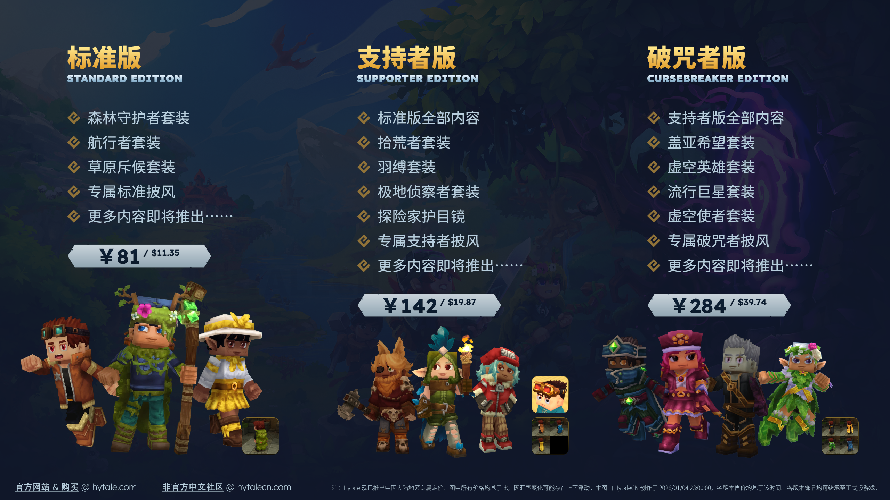

# 常见问题

### 如何购买 Hytale？

总体来说，你可以参考以下步骤完成购买：

1. **创建 Hytale 账户。**[点击此处](/official-docs/player-support/getting-started/how-to-create-a-hytale-account.md) 可查看具体操作步骤。
2. **使用刚刚注册的 Hytale 账户购买游戏。**[点击此处](/official-docs/player-support/getting-started/how-to-purchase-hytale.md) 可查看具体操作步骤。

   :::info[注意：]

   在 HytaleCN 及社区的推动下，Hytale 现已推出**国区专属定价**。 
   在进入 Hytale 商店页面（[store.hytalecn.com](https://store.hytale.com/)）时，请勿使用 VPN/加速器等，避免商店将你识别为非中国大陆地区用户，从而无法享受国区专属定价。 
   截止到 2026/01/15 23:30，Standard（标准版）、Supporter（支持者版）、Cursebreaker（破咒者版）三个版本的**国区专属定价**分别为 $11.35、$19.87、$39.74。由此你可以判断价格是否准确。

   :::

   :::tip[提示：]

   你可以在购买游戏时，在支付界面填入 `HytaleCN` 来表示对我们的支持。这可以让我们获得你实际支付金额 5% 的佣金。非常感谢你的支持！

   

   :::

3. **下载游戏。**[点击此处](/official-docs/player-support/getting-started/how-to-purchase-hytale.md) 可查看具体操作步骤。
4. **加入社区。**（可选）
   - Hytale 官方 Discord 服务器：[https://discord.gg/hytale](https://discord.gg/hytale)。更多相关内容可以 [点击此处](/official-docs/player-support/community/how-to-join-the-official-hytale-discord-server.md) 查看。
   - Hytale 非官方社区 HytaleCN（本站）：
     - 网址：[https://hytalecn.com](https://hytalecn.com)。
     - QQ 群：[https://qm.qq.com/q/V11WIqBloC](https://qm.qq.com/q/V11WIqBloC)。

### 游戏不同版本有什么区别？奖励是否可继承至正式版？

目前，不同版本的区别仅在于饰品多少，游戏本体内容是完全一致的。各版本奖励内容如下（仅展示部分）：

这些饰品均可被继承至正式版游戏；但正式版发布后，它们将**停止出售**。

### 游戏有中文吗？/ 如何下载中文补丁？

很遗憾，目前原版游戏尚不支持渲染中日韩字符。目前官方仍在努力将游戏 UI 重构并迁移至 NoesisGUI 以实现对中文等字符的支持。

不过，目前你仍可以通过社区中文补丁来解决上述问题。以下是一些推荐的解决方案：

- [高清简体中文补丁](https://www.bilibili.com/video/BV1szkwBXEas)（作者：半滴half_drop）
- [Chinese Translation (Language Pack)](https://www.curseforge.com/hytale/mods/chinese-translation-language-pack)（作者：TiltySola）

你可以 [加入 QQ 群](https://qm.qq.com/q/V11WIqBloC)（群号：962307228）来向我们推荐更多解决方案。

### 目前游戏处于什么阶段？

目前游戏正处于抢先体验（Early Access）阶段，并将可能历经数年才会发布正式版。

这意味着目前的游戏：

- **尚未完成:** 包括但不限于缺少冒险模式、故事线、任务系统、官方小游戏、社交功能、第二代世界生成系统。
- **包含错误:** 你的游戏可能会遇到崩溃、无法连接等诸多问题，在严重的情况下可能会损失数据。请牢记做好备份！

如果你已经做好心理准备，欢迎加入抢先体验行列。

### 游戏目前包含 / 缺少哪些内容？

已实装的内容：

- 探索模式
- 创造模式（含内置工具与独立工具套件）
- 模组制作支持
- 全模式多人联机支持

暂未实装的内容：

- 冒险模式（将包含丰富的剧情叙事、深度成长系统、首领战地牢等）
- 官方小游戏（趣味社交游戏与竞技多人模式）
- 默认世界生成器V2（完整的，经过修复的 Orbis（奥比斯）世界）
- 社交系统（好友列表与公会功能）

随着游戏的不断更新，缺少的内容将逐步上线。

### 如何联机？

请参考[《与好友一起游玩》](/official-docs/game-features/multiplayer/hytale-server-manual.md)。

### 如何退款？

请参考[《退款政策与可用付款方式》](/official-docs/player-resources/general/refund-policy-and-available-payment-methods.md)。

### 如何查看日志？

请参考[《如何查找你的 Hytale 日志》](/official-docs/player-resources/general/how-to-find-your-hytale-logs.md)。

### 如何在 Hytale 中录屏 / 截图？

请参考[《Hytale 的录屏与截图工具》](/official-docs/player-resources/general/recording-and-screenshot-tools-for-hytale.md)。

### 如何开服？

请参考[《Hytale 服务器手册》](/official-docs/game-features/multiplayer/hytale-server-manual.md)。
